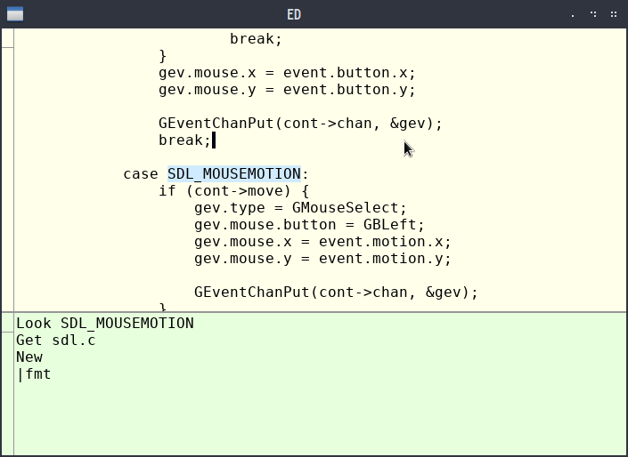

# EDIT

This repository is a fork of the [ACME-like text editor](http://c9x.me/edit/)
created by Quentin Carbonneaux.
Its [original repository](http://c9x.me/git/ed.git) is also hosted on
[Quentin's site](http://c9x.me).

I made this fork to contribute a new GUI backend based on the Simple
Directmedia Layer v.2. This is a first step on the way to full-functioning
port for MS Windows and other partially POSIX-compliant operating systems.

Now, the backend is almost fully functional. Just look at the screenshot!

Some optimizations and refactoring are coming soon.
